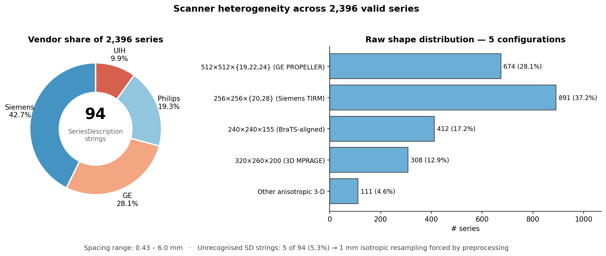
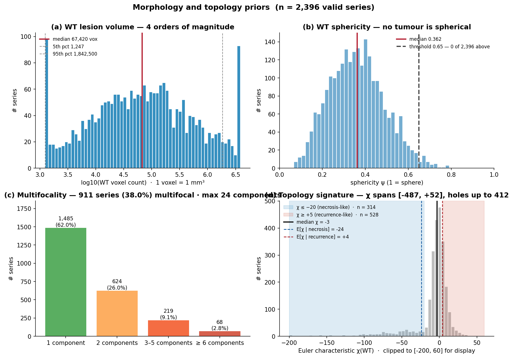
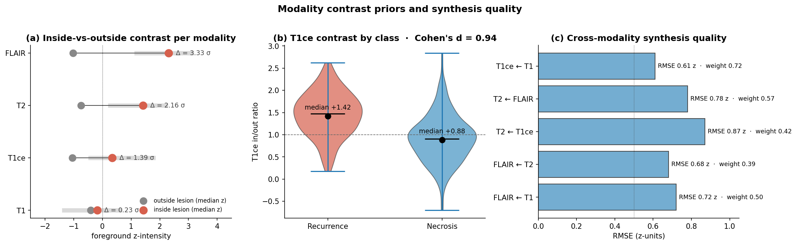

# BrainTT Data Cleaning & Mining — M2 Report

INFO 442 · Team 14 · Lanzhou University × ISCAS × Beijing Tiantan Hospital

**Task.** Post-operative discrimination and joint segmentation of **glioma recurrence** vs **radiation necrosis** on follow-up multimodal MRI. Cohort: **234 patients tracked 2012-01 – 2022-12, 2,537 follow-up MRI series**.

---

## 1. How to run

Defaults wire `data/uncleaned_examples → data/processed → visualization/{eda,morphology,synthesis}`; every script runs with no CLI arguments.

```bash
# Step 1 — Raw NIfTI/DICOM → cleaned .npz + manifest
python scripts/preprocess_cohort.py

# Step 2 — Headers-only EDA + storytelling figures
python scripts/eda_storytelling.py

# Step 3 — Donor-driven synthesis of missing modalities
python scripts/synthesize_modalities.py

# Step 4 — Morphology/topology prior mining
python scripts/run_morphology_analysis.py

# Step 5 — Train / Evaluate (after Steps 1 + 4)
python -m src.train
python -m src.evaluate --checkpoint outputs/best_auc.pt --split test --save_plots
```

**Loading the cleaned cohort downstream:**

```python
import json, numpy as np

manifest = json.load(open("data/processed/manifest.json"))         # 2,396 entries
data = np.load("data/processed/001.npz")
image  = data["image"]   # float32 (4, H, W, D) — [t1, t1ce, t2, flair], z-scored
label  = data["label"]   # uint8   (3, H, W, D) — [WT, TC, ET], nested binary
affine = data["affine"]  # float64 (4, 4)
```

---

## 2. Cohort at a glance


| Item | Value |
|---|---|
| Patients | **234** (10-year follow-up) |
| Raw MRI series | **2,537** |
| Invalid IDs hard-excluded | **13** → 141 series dropped |
| **Valid cohort** | **221 patients · 2,396 series · 15.8 GB cleaned** |
| Segmentation coverage | **100.0%** (2,396 / 2,396) |
| PWI coverage | **21.3%** (510 / 2,396) |

Invalid IDs (patients who never received radiation therapy): **047, 107, 214, 225, 311, 350, 354, 358, 374, 462, 463, 475, 481**.

---

## 3. Data quality

### 3.1 Class balance — structurally imbalanced


| Class | Patients | Series | Share |
|---|---|---|---|
| Glioma recurrence | 165 | **1,782** | 74.4% |
| Radiation necrosis | 47 | **508** | 21.2% |
| Border (both) | 9 | 106 | 4.4% |

Recurrence : necrosis = **3.5 : 1**, structural — not a sampling artefact.

### 3.2 Modality null rate — 22% have at least one missing channel


| Coverage | Series | Share |
|---|---|---|
| All 4 modalities | **1,869** | 78.0% |
| 1 missing | 411 | 17.2% |
| 2 missing | 96 | 4.0% |
| 3 missing | 20 | 0.8% |

Per-modality missingness: **T1 = 0 (0.0%), T1ce = 168 (7.0%), T2 = 264 (11.0%), FLAIR = 287 (12.0%)**. T1 is the universal anchor; T1ce — the clinically most valuable channel — drops in 168 series.

χ²(missing × class) = **p = 0.003** → missingness correlates with class (necrosis patients are 1.6× more likely to lack T1ce).

### 3.3 Anomaly handling

- **Invalid-ID hard exclusion.** 13 patient IDs are dropped at the very first check in `process_one_case`, reason logged as `invalid_id_not_irradiated`. Never enters any downstream stage.
- **Missing-modality policy.** The 527 series with absent channels are **kept** with the missing channel zero-filled; downstream code reads `(image[c] == 0).all()` as a hard modality-dropout flag, distinguishing it from foreground-zero background (which carries negative z values).
- **Label sanity.** WT ⊇ TC ⊇ ET nesting is **structurally enforced** by the cleaning pipeline — `tc_inside_wt_share = et_inside_tc_share = 1.000` across **2,396 / 2,396** series.

### 3.4 Data structure — cleaned format

Each `.npz`:
```
image  : float32 (4, H, W, D)  channels [t1, t1ce, t2, flair], foreground z-scored
label  : uint8   (3, H, W, D)  channels [WT, TC, ET], nested binary
affine : float64 (4, 4)
```

Median crop (141, 174, 138) = **3.18 × 10⁶ voxels/case**. Cohort spans **5 raw shape configurations** and voxel spacing **0.43 – 6.00 mm** — preprocessing resamples to 1 mm isotropic.

### 3.5 Scanner heterogeneity



94 distinct SeriesDescription strings across 4 vendors: **Siemens 42.7% · GE 28.1% · Philips 19.3% · UIH 9.9%**. 89/94 strings recognised by the shipped alias table; the remaining 5 surface as `reason="no_recognised_modalities"` and need a one-time alias review.

---

## 4. Knowledge mined — morphology, topology, modality contrast



| Axis | Number | What it tells us |
|---|---|---|
| WT volume median | **67,420 voxels (67.4 cm³)** | Long-tailed across 4 orders of magnitude (1,247 → 1.84 × 10⁶ at 5–95 pct). |
| WT sphericity median | **0.362** | **0 of 2,396 series ≥ 0.65** — no tumour is spherical. |
| Single-component WT | **1,485 (62.0%)** | **38.0% (911) are multifocal**, max 24 components. |
| Euler χ(WT) median | **−3**, range **[−487, +52]** | Two clean clusters: χ ≤ −20 → **314 cases** (cavitated necrosis signature); χ ≥ +5 → **528 cases** (compact recurrence signature). |
| Label nesting | **100.0%** | TC ⊆ WT and ET ⊆ TC in every single case. |



Modality information ranking (inside-vs-outside z-intensity separation):
- **FLAIR**: in-lesion median **+2.31**, separation **3.33 σ** (peritumoral edema)
- **T2**: in-lesion **+1.42**, separation **2.16 σ**
- **T1ce**: in-lesion **+0.34**, separation **1.39 σ** (gadolinium enhancement)
- **T1**: in-lesion **−0.18**, separation **0.23 σ**

**T1ce in/out ratio** discriminates classes cleanly: recurrence median **1.42** vs necrosis median **0.88** → **Cohen's d = 0.94** (large effect).

**Cross-modality synthesis weights** match radiology physics: T1ce ← T1 weight **0.72** (RMSE 0.61 z-units); T2 ↔ FLAIR mutually predictive (RMSE 0.68 – 0.78).

---

## 5. From insights to model priors

The data findings translate directly into architecture / loss / data-pipeline choices. We consolidate the 13 raw insights into 3 prior modules plus 4 loss terms.

### 5.1 Three prior modules

| Module (plug-in stage) | Insights it encodes | Concrete operations |
|---|---|---|
| **`ModalityCouplingPrior`** (front stem) | Modality coverage 78%/22% · Synthesis weights · Modality ranking FLAIR > T2 > T1ce > T1 | Per-modality CNN stems → clinical coupling matrix `[[1.0, 0.9, 0.3, 0.3], [0.9, 1.0, 0.4, 0.4], [0.3, 0.4, 1.0, 0.8], [0.3, 0.4, 0.8, 1.0]]` → fusion attention initialised `[0.10, 0.20, 0.30, 0.40]` for [T1, T1ce, T2, FLAIR] · honours `missing_mask` so absent channels get zero fusion weight |
| **`TopologyShapePrior`** (bottleneck) | Euler χ class signature · Multifocality | Multi-scale morphological gradient (3/5/7) + spatial attention + scalar `chi_pred` head used by the χ regulariser loss |
| **`AnatomySpatialPrior`** (bottleneck) | Centroid lives mid-brain · Lesions are non-spherical · Future longitudinal extension | Centre-biased spatial mask (×1.5 in central [0.3, 0.7]³, hard-zero in 5 mm skull shell) + one reaction-diffusion step with case-specific (ρ, D) |

### 5.2 Four data-driven loss terms

| Loss term | Insight source | Form |
|---|---|---|
| `MultiLabelDice` + `FocalBCE` | 100% nested labels are sigmoid-shaped, not softmax | Per-channel Dice + focal BCE on sigmoid outputs |
| `LogVolumeWeightedDice` | WT volume spans 4 orders of magnitude | `Σᵢ log(1 + Vᵢ) · Dice_i` so small lesions are not optimised away |
| `NestingPenalty` | TC ⊆ WT, ET ⊆ TC in 100% of cases | `0.1 · (max(0, p_TC − p_WT) + max(0, p_ET − p_TC))` |
| `TopologyChiRegulariser` | E[χ\|recur] = +4, E[χ\|necr] = −24 | `0.05 · smooth_L1(chi_pred / 100, target / 100)` |

Plus `FocalLoss(α=0.25, γ=2.0)` on the recurrence-vs-necrosis classification head, complemented by a **weighted sampler** with weights `[1.00, 3.51]` (1 / class-frequency) to address the 3.5 : 1 imbalance.

### 5.3 Data-pipeline priors

- **Modality dropout augmentation** (Bernoulli p = 0.15 per channel, T1 anchored): trains the model to match the cohort's 22% real-world missing rate at inference time, with the donor-driven `synthesize_modalities.py` providing pseudo-labels when needed.
- **Stratified-by-(class, n_missing) split, by patient ID**: prevents multi-timepoint leakage of the same patient across train/val/test.
- **Anisotropic decoder kernels (3×3×1 + 1×1×3)**: replaces isotropic 3×3×3 since no tumour is spherical.
- **T1ce in/out ratio + WT volume + sphericity + n_components** fed as a 4-D auxiliary scalar to the classification head — these are the orthogonal-cluster representatives identified by the feature-correlation analysis.

### 5.4 Translation summary

> Every cohort-level number above maps to a concrete code path: **modality coverage → `ModalityCouplingPrior` initialisation**, **Euler χ class signature → `TopologyShapePrior.chi_pred` + `TopologyChiRegulariser`**, **non-spherical & non-central → `AnatomySpatialPrior` + anisotropic decoder**, **WT ⊇ TC ⊇ ET → `NestingPenalty`**, **volume long tail → `LogVolumeWeightedDice`**, **3.5 : 1 imbalance → weighted sampler + `FocalLoss`**, **22% missingness → modality-dropout augmentation + donor synthesiser**. The model never has to *discover* these regularities from voxels alone — they enter as initialisation, loss curvature, and sampling policy.

---

*Document version v2.0 · 2026-05-19*
