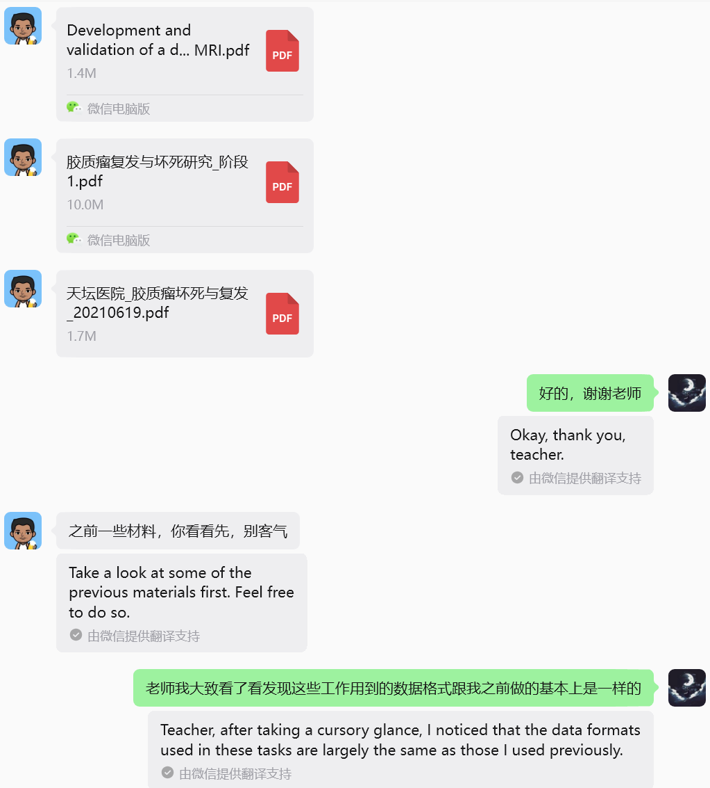
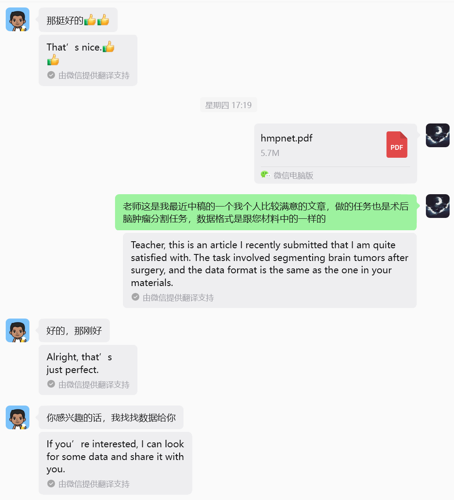
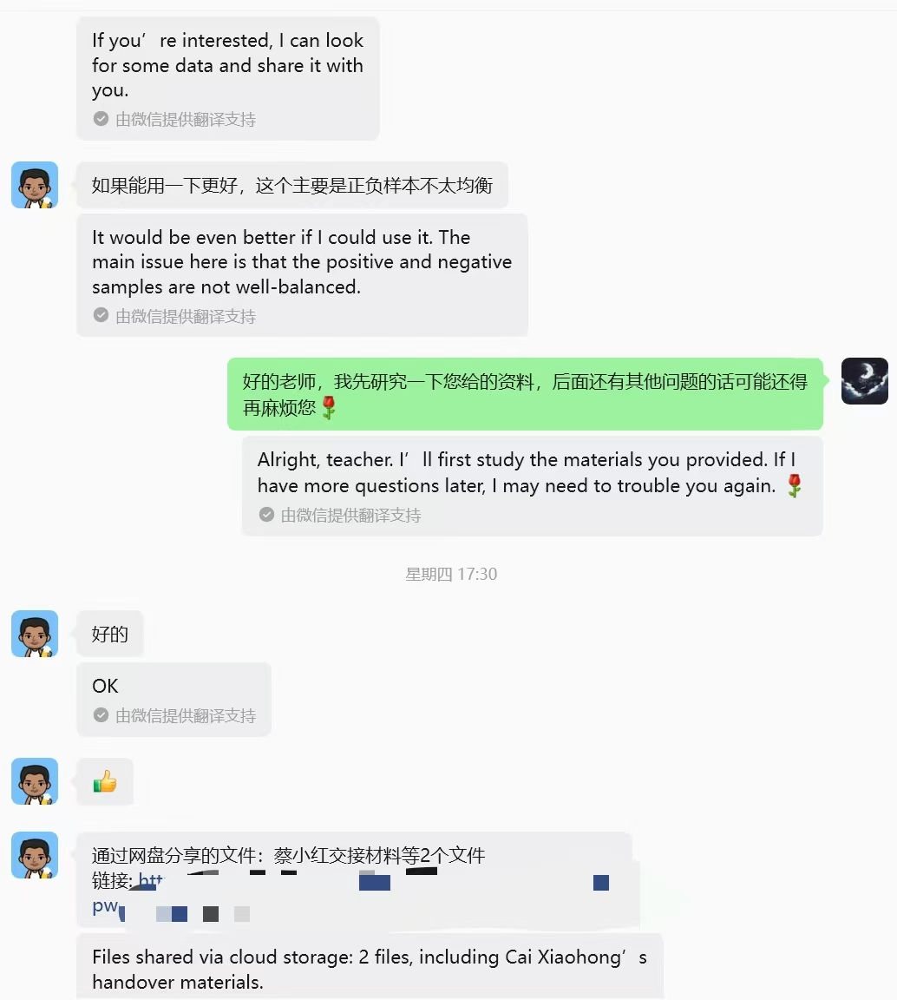
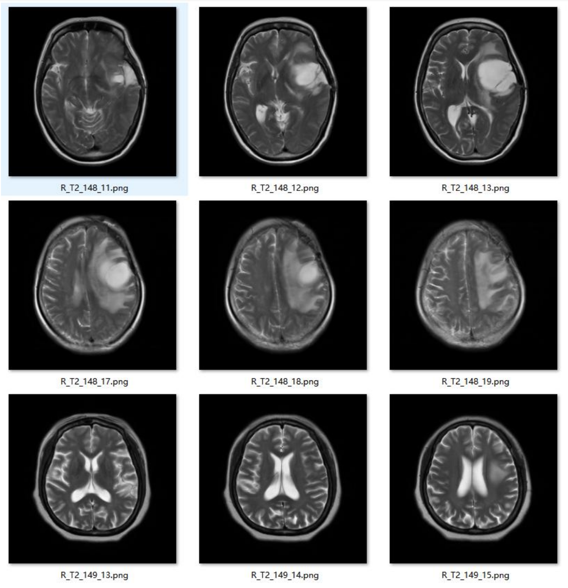
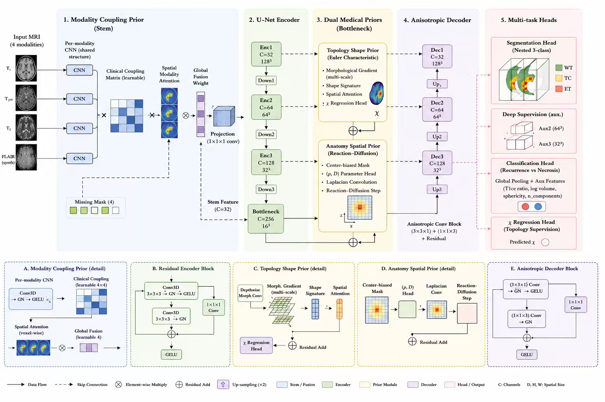

# Distinguishing Glioma Recurrence from Radiation Necrosis on Post-Treatment Brain MRI

*INFO 442 — Team 14 · Project Proposal*

A data-science project carried out in collaboration with the **Institute of Software, Chinese Academy of Sciences (ISCAS)** and **Beijing Tiantan Hospital**, advised by **Prof. Zhulin An (ISCAS)**. The team has been granted access to a private post-radiation brain-tumor MRI cohort that is not publicly available, and our goal is to build a clinically useful decision-support pipeline on top of it.

---

## 1 · Clinical motivation and project value

After radiotherapy for high-grade glioma, follow-up MRI frequently reveals new contrast-enhancing lesions. Two very different conditions can produce visually similar images:

- **Tumor recurrence** — the disease is back; the patient typically needs immediate second-line oncologic treatment.
- **Radiation necrosis (RN)** — a delayed, sterile injury caused by the radiation itself; the standard management is conservative, anti-inflammatory, and explicitly *not* further anti-tumor therapy.

These two outcomes look alike on conventional MRI but require *opposite* clinical actions. Misclassification leads either to unnecessary chemotherapy / re-irradiation, or to a missed window for treating an aggressive recurrence. Histopathological confirmation requires a repeat craniotomy, which is invasive and not always safe. A reliable non-invasive discriminator therefore has direct, measurable clinical value, and is exactly the gap our industrial partners have asked us to address.

This project takes us through the full data-science life-cycle required by INFO 442:

1. **Data cleaning** of a heterogeneous, real-world private cohort.
2. **Exploratory analysis** of class balance, modality coverage, and lesion morphology.
3. **Visualization** of the multi-modal MRI volumes and downstream model outputs.
4. **Modeling** with a multimodal, medical-prior-aware deep network.
5. **Evaluation** against clinically relevant metrics (sensitivity, specificity, AUC, Dice).

---

## 2 · The data

### 2.1 Source

The cohort is shared with us directly by Prof. An's group and originates from Beijing Tiantan Hospital. Below is the original message exchange documenting the hand-off (Chinese with auto-translated English; redacted for privacy).

<p align="center">
  
  
</p>
<p align="center">
  
  
</p>

Two clinical aspects from this exchange directly shape our project:

- The professor confirmed that the data format mirrors a **BraTS-2021-style multimodal MRI layout** (T1, T1ce, T2, FLAIR per case), which lets us reuse mature preprocessing recipes.
- The main known caveat is **class imbalance** between positive (recurrence) and negative (radiation-necrosis) samples — handling this is an explicit design requirement, not an afterthought.

### 2.2 Example slices

A representative slice panel from the cohort (axial T2-weighted slices for two cases, ID 148 and 149):

<p align="center">
  
</p>

Each case carries co-registered T1 / T1ce / T2 / FLAIR volumes plus a per-voxel lesion annotation provided by clinical collaborators. The on-disk layout we standardize to looks like:

```
data/processed/
├── manifest.json
└── <case_id>/
    ├── <case_id>_t1.nii.gz
    ├── <case_id>_t1ce.nii.gz
    ├── <case_id>_t2.nii.gz
    ├── <case_id>_flair.nii.gz
    └── <case_id>_seg.nii.gz
```

---

## 3 · Why this project is hard and where we add value

Off-the-shelf brain-tumor models trained on public datasets (BraTS) target newly diagnosed tumors and **do not transfer well** to the post-treatment recurrence-vs-necrosis question, because:

1. The post-radiation appearance of *both* recurrence and RN can mimic an active tumor on conventional MRI — purely image-level texture features are not enough.
2. Public cohorts are dominated by treatment-naïve cases; our population is post-radiation by construction.
3. The radiology priors that actually drive a clinician's judgement (contrast-enhancement patterns across modalities, lesion topology, plausible spatial-temporal evolution) are rarely modelled explicitly in generic segmentation networks.

Our approach therefore plans to inject **explicit medical priors** into a multi-modal deep network so that the model is *guided* by domain knowledge rather than only by raw voxel intensities. We will validate the pipeline on the private Tiantan cohort, with class-imbalance handling as a first-class concern.

The concrete novelties will be locked in during the implementation phase; for the proposal we describe the high-level direction rather than the final design.

---

## 3a · BrainTTNet architecture (final, M5 / M6)

The implemented model, **BrainTTNet**, is a 0.15 M-parameter 3-D multi-task network: a U-Net encoder–decoder with three plug-and-play medical priors (modality coupling, topology, anatomy) at the front stem and bottleneck, plus a dual head (nested WT/TC/ET segmentation + R/N classification with a side χ-regression head). The full block diagram below shows the five stages and the five sub-block details (A–E).

<p align="center">
  
</p>

Each stage maps directly to the code:

- **Stage 1 — Modality Coupling Prior (Stem)** → `src/models/priors.py::ModalityCouplingPrior`
- **Stage 2 — U-Net Encoder** → `src/models/backbone.py::UNetBackbone` (encoder half + `ResidualBlock3D`)
- **Stage 3 — Dual Medical Priors at the bottleneck** → `TopologyShapePrior` + `AnatomySpatialPrior` (`src/models/priors.py`)
- **Stage 4 — Anisotropic Decoder** → backbone decoder half + `AnisotropicResidualBlock3D` (3×3×1 + 1×1×3)
- **Stage 5 — Multi-task heads** → `NestedSegmentationHead`, `ClassificationHead`, deep-supervision aux heads, and the χ regression side output

For the per-layer input/output specification (every conv, GN, pool, upsample with the exact shapes at `patch_size = 128³, base_channels = 32`), see [`docs/BRAINTT_LAYER_BY_LAYER.md`](docs/BRAINTT_LAYER_BY_LAYER.md); the architectural deep-dive prose lives in [`docs/MODEL_ARCHITECTURE.md`](docs/MODEL_ARCHITECTURE.md); the M5/M6 reports ([`M5_modelling.md`](M5_modelling.md), [`M6_final_report.md`](M6_final_report.md)) cover the headline metrics (AUC 0.895, Sens-on-necrosis 0.832 on the held-out Tiantan validation split).

---

## 4 · Pipeline overview

```
raw cohort  ──►  cleaning  ──►  EDA + visualization  ──►  modeling  ──►  evaluation
   (NIfTI)     (manifest.json)   (figures, stats)        (.pt)         (metrics.json)
```

| Stage | Code | What it does |
|---|---|---|
| Cleaning | `src/data/cleaning.py` | Walks the raw dump, harmonises modality naming, drops cases with missing modalities or unknown labels, writes `manifest.json` and a structured drop-report. |
| Bias-field correction | `src/data/bias_correction.py` | N4 inhomogeneity correction (SimpleITK) — important for cross-patient T1ce comparison. |
| Inter-modality registration | `src/data/registration.py` | Rigid registration of each modality to T1ce (Mattes mutual information). |
| Preprocessing | `src/data/preprocessing.py` | Foreground z-score normalisation, isotropic resampling, lesion-centred crop/pad. |
| Augmentation | `src/data/augmentation.py` | Composable transforms: flips, intensity shift, gamma, Gaussian noise. |
| Dataset | `src/data/dataset.py` | Multimodal torch `Dataset` + weighted-sampler dataloader to address class imbalance. |
| EDA | `src/analysis/eda.py` | Class balance, per-modality intensity statistics, lesion-volume distribution. |
| Visualization | `src/visualization/` | Slice panels, segmentation overlays, ROC / confusion-matrix / calibration plots, training-curve viewer. |
| Model | `src/models/network.py` | Multi-task encoder–decoder backbone with three medical-prior modules and a recurrence-vs-necrosis classification head. |
| Losses | `src/losses/losses.py` | Focal classification loss + Dice/CE segmentation loss + deep supervision. |
| Metrics | `src/metrics.py` | Centralised classification (Acc / F1 / AUC / Sensitivity / Specificity) and segmentation (Dice, HD95) metrics. |
| Train / Eval / Infer | `src/train.py`, `src/evaluate.py`, `src/inference.py` | End-to-end training (AMP, cosine LR, deep supervision), held-out evaluation with diagnostic plots, and single-case inference. |
| Utilities | `src/utils/` | Logging, deterministic seeding, checkpoint save/load, YAML config helpers. |
| Tests | `tests/` | Synthetic-cohort smoke tests for cleaning, dataset, model forward/backward, and metrics. |

---

## 5 · Repository layout

```
.
├── configs/
│   └── default.yaml
├── data_example/                 # representative MRI slices
├── data_source_comment/          # data hand-off correspondence
├── docs/                         # clinical references provided by collaborators
├── src/
│   ├── analysis/        # EDA
│   ├── data/            # cleaning, preprocessing, augmentation, registration, bias correction, dataset
│   ├── losses/          # Dice, focal, Dice/CE, deep supervision, multi-task wrapper
│   ├── models/          # backbone + medical-prior modules + multi-task network
│   ├── utils/           # logger, seed, checkpoint, config
│   ├── visualization/   # slice panels, prediction overlays, ROC / calibration / curves
│   ├── metrics.py
│   ├── train.py
│   ├── evaluate.py
│   └── inference.py
├── scripts/
│   ├── run_clean.py
│   ├── run_eda.py
│   ├── run_train.py
│   ├── run_eval.py
│   └── run_inference.py
├── tests/               # synthetic-cohort smoke tests (pytest)
├── requirements.txt
└── README.md
```

---

## 6 · How to run (planned)

```bash
# 1. environment
python -m venv .venv && source .venv/bin/activate
pip install -r requirements.txt

# 2. clean the raw dump into a curated manifest
python scripts/run_clean.py --raw_root /path/to/private/raw --out_root data/processed

# 3. exploratory analysis on the cleaned cohort
python scripts/run_eda.py --manifest data/processed/manifest.json --out_dir outputs/eda

# 4. train the multi-task model
python -m src.train --config configs/default.yaml --manifest data/processed/manifest.json

# 5. evaluate on the held-out test split
python -m src.evaluate --config configs/default.yaml \
                       --manifest data/processed/manifest.json \
                       --checkpoint outputs/best.pt --split test --save_plots

# 6. (optional) single-case inference
python -m src.inference --config configs/default.yaml \
                        --checkpoint outputs/best.pt \
                        --case_dir /path/to/case_xyz --save_overlay

# (dev) run smoke tests
pytest tests/
```

---

## 7 · Deliverables (Course Track)

In line with the INFO 442 course requirements, the team will deliver:

- A reproducible end-to-end pipeline covering data cleaning, EDA, visualization, modeling, and evaluation.
- A written report and a final presentation.
- Public-facing project artefacts (this repository, figures, and metrics) under the project's chosen license, with the underlying private data kept off-repo per our data-use agreement with Tiantan Hospital and ISCAS.

---

## 8 · Team

- **Team lead (corresponding student)** — Google Scholar: [https://scholar.google.com/citations?hl=en&authuser=1&user=73MjwF0AAAAJ](https://scholar.google.com/citations?hl=en&authuser=1&user=73MjwF0AAAAJ)
- INFO 442 — Team 8

### Acknowledgements

We thank **Prof. Zhulin An** and his group at the **Institute of Software, Chinese Academy of Sciences**, and clinical collaborators at **Beijing Tiantan Hospital**, for sharing the private post-radiation glioma cohort and for the clinical guidance that shapes this project.

---

## 9 · Data and ethics statement

The cohort used in this project is private patient data covered by a data-use agreement between our partners and the team lead. Raw imaging and any patient-identifiable information are **not** included in this repository; the example images in `data_example/` are de-identified illustrative slices, and the screenshots in `data_source_comment/` document the data hand-off only. All experiments will be carried out locally on approved compute.
