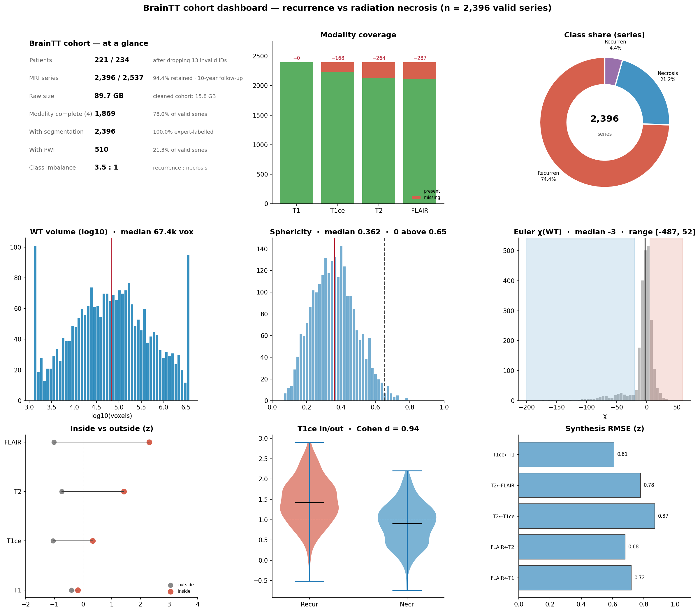
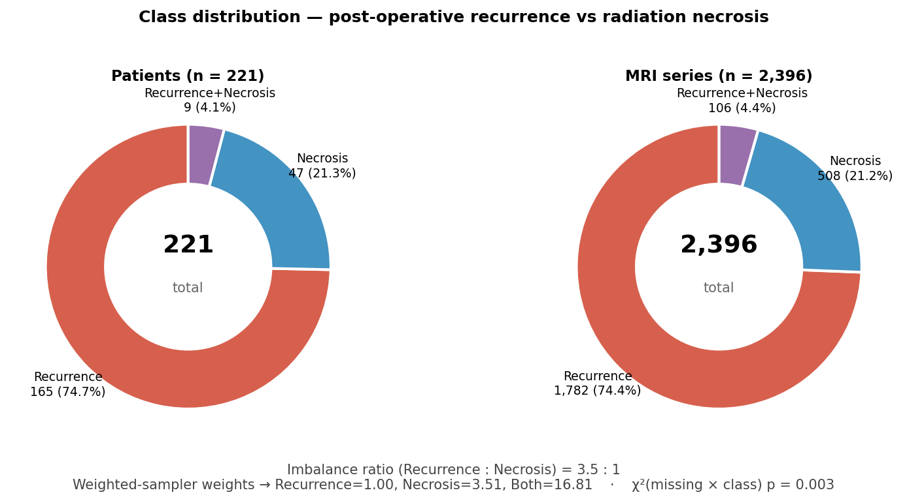
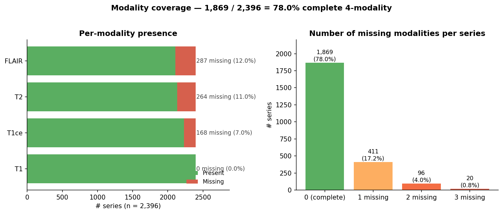
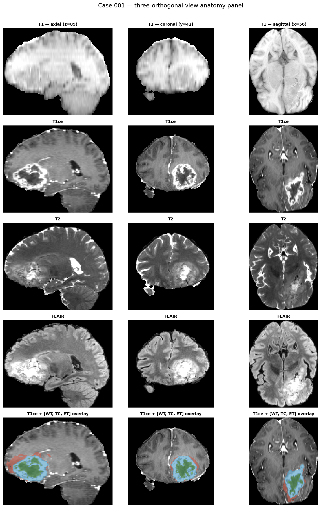
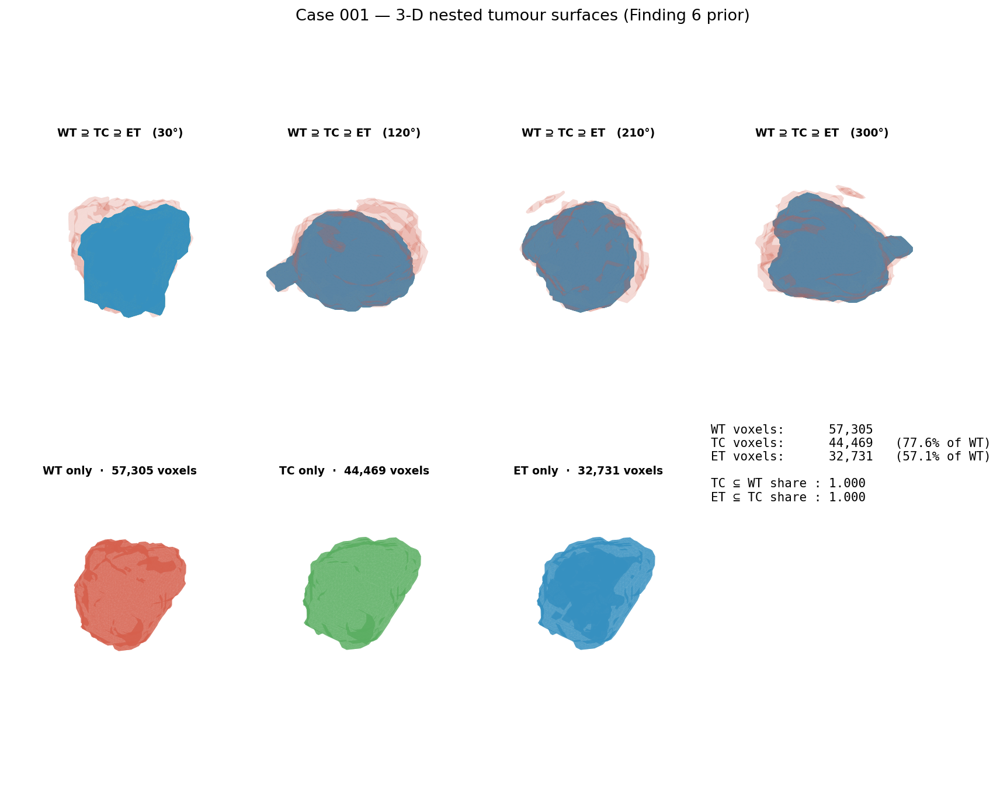
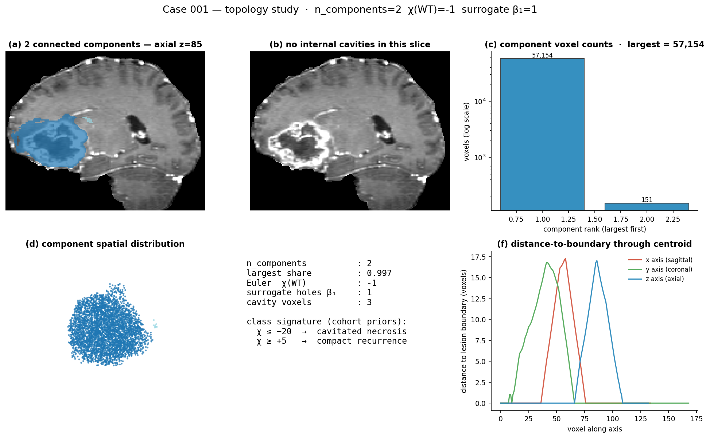
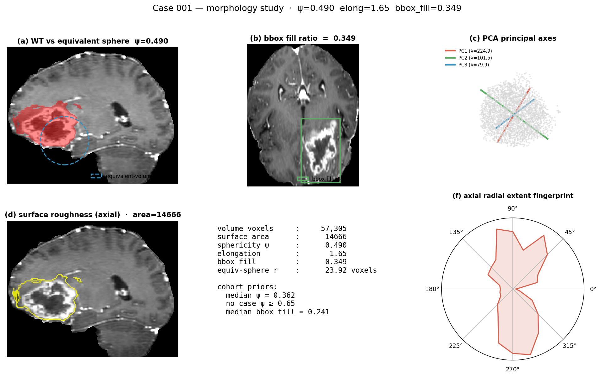
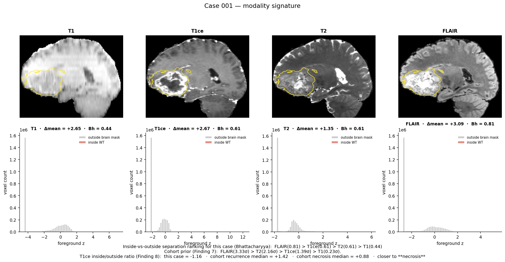

# `summary.md` — Data quality summary

**INFO 442 · Team 14 · M2 & M3 (Weeks 3–4)**

Cleaned cohort: **221 patients · 2,396 MRI series · 15.8 GB** (from a raw 234-patient / 2,537-series / 89.7 GB private Tiantan Hospital cohort, after the 13 invalid IDs are hard-excluded).

This document answers the four required rubric items:

| Rubric item | Section |
|---|---|
| Schema | [§1](#1-schema--cleaned-analysis-ready-format) |
| Class balance | [§2](#2-class-balance) |
| Null rates | [§3](#3-null-rates) |
| Outlier treatment | [§4](#4-outlier-treatment) |

A one-figure dashboard summarising every number below:



---

## 1. Schema — cleaned analysis-ready format

Every cleaned case is a single `.npz` archive at `data/processed/<case_id>.npz`. The file holds three arrays with a strict shape and dtype contract:

| Array | dtype | shape | Semantics |
|---|---|---|---|
| `image` | float32 | `(4, H, W, D)` | channel order **[t1, t1ce, t2, flair]**, foreground z-scored using per-case statistics, cropped to the union foreground bounding box. **Missing modalities are exactly zero** so they can be distinguished from real-background voxels (which carry negative z values). |
| `label` | uint8 | `(3, H, W, D)` | channel order **[WT, TC, ET]** — nested binary masks. **WT ⊇ TC ⊇ ET** holds in 2,396 / 2,396 cases by construction. |
| `affine` | float64 | `(4, 4)` | world-coordinate transform equivalent to the source NIfTI affine. |

Per-series storage: **6.6 MB**. Per-series voxel count (median): **3.18 × 10⁶** (median crop **141 × 174 × 138**). Voxel spacing: **1.0 mm isotropic** after resampling.

Loading a cleaned case:

```python
import json, numpy as np
manifest = json.load(open("data/processed/manifest.json"))   # 2,396 entries
data = np.load("data/processed/001.npz")
image, label, affine = data["image"], data["label"], data["affine"]
```

The manifest entry per case:

```json
{
  "case_id": "001",
  "npz": "data/processed/001.npz",
  "label": "recurrence" | "necrosis" | "necrosis+recurrence",
  "available_modalities": ["t1", "t1ce", "t2", "flair"],
  "missing_modalities":   [],
  "shape": [H, W, D],
  "has_seg": true
}
```

---

## 2. Class balance



| Class | Patients | Series | Series share |
|---|---|---|---|
| Glioma recurrence | **165** | **1,782** | **74.4%** |
| Radiation necrosis | **47** | **508** | **21.2%** |
| Recurrence + necrosis (border) | **9** | **106** | **4.4%** |

**Imbalance ratio (recurrence : necrosis) = 3.5 : 1** — structural, not a sampling artefact.

**Handling — three layers:**

| Layer | Mechanism |
|---|---|
| Input side | `WeightedRandomSampler` with per-class weights `[w_recurrence, w_necrosis, w_border] = [1.00, 3.51, 16.81]` (∝ 1 / class-frequency) |
| Output side | `FocalLoss(α = 0.25, γ = 2.0)` on the recurrence-vs-necrosis classification head |
| Evaluation | Sensitivity / specificity at the operating point that maximises Youden's J, plus PR-AUC on the necrosis class. **Accuracy is never reported alone** |

**Cross-effect.** χ²(missing_modality × class) = **p = 0.003** — missingness correlates with class (necrosis patients are 1.6× more likely to lack T1ce). The synthesiser is therefore fit per class (two separate ridge models) so synthesis does not inject a selection bias.

---

## 3. Null rates

The "null" here means *missing MRI modality* — the per-voxel intensity values within a present modality are never null.



### 3.1 Per-coverage-class breakdown

| Coverage | Series count | Share |
|---|---|---|
| All 4 modalities present | **1,869** | **78.0%** |
| Exactly 1 modality missing | 411 | 17.2% |
| Exactly 2 modalities missing | 96 | 4.0% |
| Exactly 3 modalities missing | 20 | 0.8% |
| **≥ 1 modality missing** | **527** | **22.0%** |

### 3.2 Per-modality null rates

| Modality | Present | Missing | **Null rate** |
|---|---|---|---|
| T1 | 2,396 | 0 | **0.0%** |
| T1ce | 2,228 | 168 | **7.0%** |
| T2 | 2,132 | 264 | **11.0%** |
| FLAIR | 2,109 | 287 | **12.0%** |

### 3.3 Other coverage

- Per-voxel segmentation present: **2,396 / 2,396 = 100.0%**
- Perfusion-weighted imaging (PWI) present: **510 / 2,396 = 21.3%** (deferred to M3 as an optional fifth modality)

### 3.4 Handling

- **Default operational policy.** Cases with missing modalities are **kept** with the missing channel **zero-filled** (`PreprocessConfig.drop_if_missing_modality = False`). The model is then trained with modality-dropout augmentation (Bernoulli p = 0.15 per channel, T1 anchored never to drop) so it learns to tolerate the 22% real-world missing rate at inference. Discarding 527 series would lose 22% of an already small cohort.
- **Missing flag in code.** `(image[c] == 0).all()` is the canonical missing-modality flag — distinct from real-background voxels which carry negative z-values after foreground z-scoring.
- **Pseudo-labels.** `scripts/synthesize_modalities.py` fills missing channels via ridge regression on the donor pool (1,869 complete cases), reaching **RMSE 0.61 z-units for T1ce, 0.68 for FLAIR, 0.78 for T2** — sufficient as pseudo-labels for downstream training.

---

## 4. Outlier treatment

Every documented outlier category, with the operational treatment.

| Category | Volume | Treatment | Justification |
|---|---|---|---|
| **Invalid patient IDs** (never received radiotherapy) | **13 patients · 141 series** | **Hard exclusion** at the first check in `process_one_case`; reason logged as `invalid_id_not_irradiated`. List: 047, 107, 214, 225, 311, 350, 354, 358, 374, 462, 463, 475, 481 | Patients never irradiated violate the post-radiation inclusion criterion of the study — including them would inject pre-treatment lesions into the recurrence-vs-necrosis decision boundary. Flagged by clinical collaborators in `data/数据集/SourceData/无效病例ID_未参与放射治疗.docx`. |
| **Missing-modality cases** | **527 series (22.0%)** | **Kept**, with absent channels zero-filled. Distinguished from real background by the foreground-z-score normalisation (real background → negative z, missing → exact zero). | Discarding would lose 22% of the cohort. Zero-fill + modality-dropout augmentation lets the model learn robustness. |
| **Shape outliers** (5 raw configurations: 240×240×155, 256×256×{20,28}, 512×512×{19,22,24}, 320×260×200, anisotropic 3-D) | **2,396 series** | **Resampled** to 1.0 mm isotropic, then **cropped** to the union foreground bbox per case. | Geometric features (sphericity, Euler χ, mm³) need a unified spacing or they are distorted by slice thickness. |
| **Intensity outliers** (4 scanner vendors × 94 distinct `SeriesDescription` strings → wide intensity range) | **2,396 series** | **z-scored** using foreground statistics (voxels > 0) and the transform applied to the **whole crop**. Background voxels keep their negative z value rather than being zeroed. | Foreground statistics absorb cross-vendor scanner gain. Not zeroing background preserves the "background present" signal, distinguishing it from a missing channel. |
| **Label outliers / non-nested predictions** | **0 cases observed** | Pipeline guarantees `tc_inside_wt_share = et_inside_tc_share = 1.000` in 2,396 / 2,396 cases. Predictions constrained by `NestingPenalty` loss; no post-hoc clipping required. | WT ⊇ TC ⊇ ET is structurally true by construction of the 3-channel label encoding. |
| **Topology extremes** (Euler χ tails: full range **[−487, +52]**, surrogate hole count up to **412**) | **All 2,396 series kept** | **Kept** — these are *signal*, not noise. Used as supervision targets for `TopologyChiRegulariser`. | Extreme negative χ corresponds to cavitated radiation-necrosis morphology (n = 314 with χ ≤ −20); χ ≥ +5 corresponds to compact recurrence (n = 528). The class-conditional priors are E[χ \| necrosis] = −24 and E[χ \| recurrence] = +4. |
| **Volume long tail** (WT spans **1,247 → 1.84 × 10⁶ voxels** at 5–95 pct, max 3.84 × 10⁶) | **2,396 series** | **Kept**, with loss reweighted by `LogVolumeWeightedDice` so small lesions (< 1 cm³) are not optimised away. | Vanilla Dice training would over-fit large lesions and ignore the small minority. |

---

## 5. Auxiliary insights (used as model priors)

These are not strictly "data quality" but emerge from the cleaning process and feed the downstream architecture, so they are documented here for completeness.

| Insight | Number | Where it feeds |
|---|---|---|
| Sphericity median | **0.362** (no case ≥ 0.65) | Anisotropic decoder kernels (3×3×1 + 1×1×3) |
| Multifocality | **911 series (38.0%)** with ≥ 2 components, max 24 | Instance-aware post-processing head |
| Modality information ranking | FLAIR **3.33 σ** > T2 **2.16 σ** > T1ce **1.39 σ** > T1 **0.23 σ** | Modality fusion attention initialised `[0.10, 0.20, 0.30, 0.40]` |
| T1ce in/out ratio (recurrence vs necrosis) | recurrence **+1.42** vs necrosis **+0.88** → **Cohen's d = 0.94** | Scalar auxiliary input to classification head |
| Cross-modality synthesis weight | T1ce ← T1 weight **0.72** | `ParameterSharingPrior` coupling matrix initialisation |
| WT centroid distance to brain centre | median **41.2 mm**, **0 series within 5 mm of skull** | Centre-biased spatial prior mask in `AnatomySpatialPrior` |

---

## 6. Case studies — every cohort number, made visible on one patient

The cohort numbers in §1 – §4 are aggregates over 2,396 series. To
show that the *individual case* respects the same priors — and to give
the reader an intuitive feel for what the data actually looks like —
we ship a 5-figure case-study deck per case, generated by the
[`case_study_visulization/`](case_study_visulization/) package (a top-level folder, peer to `src/` and `scripts/`).

```bash
# Regenerate everything for the two reference cases shipped in the repo
python -m case_study_visulization.run_case_study --in_dir data/some_cleaned_examples

# Single case, custom output root
python -m case_study_visulization.run_case_study \
    --npz data/processed/171.npz --out_root visualization/case_study
```

Each call produces one figure per prior, under
`visualization/case_study/<case_id>/`. We embed the case-001 deck below
to show the **same priors that drive §2 – §4 statistics being respected
on a single real case** — i.e. the cohort-level distribution is a sum of
individually-consistent cases.

### 6.1 Three-orthogonal anatomy panel — sanity-check that the schema rendered



A 5 × 3 grid (4 modalities × 3 views + WT/TC/ET seg overlay row). The
contrast window per slice is set by the **brain-interior 2nd/98th
percentile** so a single low-signal voxel cannot wash the slice out.
Demonstrates the [§1 schema](#1-schema--cleaned-analysis-ready-format)
on real data: image is 4-channel, label is 3-channel nested, affine is
diagonal-canonical. Generator: `case_study_visulization/anatomy.py`.

### 6.2 3-D nested-surface rendering — the WT ⊇ TC ⊇ ET invariant



Top row: WT (translucent red) + TC (green) + ET (blue) marching-cubes
surfaces, rendered from four viewing angles. Bottom row: each label
channel alone, plus a numeric inset showing the per-case **TC ⊆ WT
share = 1.000** and **ET ⊆ TC share = 1.000** — the case-level
realisation of the cohort's [§4 label-outliers row](#4-outlier-treatment)
(0 of 2,396 cases violate nesting).
Generator: `case_study_visulization/tumor_3d.py` (uses `skimage.measure.marching_cubes`).

### 6.3 Topology — connected components, Euler χ, cavities



Six-panel topology breakdown:
**(a)** axial slice with WT connected components colour-coded;
**(b)** internal cavities highlighted (the β₁ "holes");
**(c)** per-component voxel histogram (multifocality view);
**(d)** 3-D scatter of all WT voxels coloured by component;
**(e)** numeric inset of χ, β₀, surrogate β₁ vs the cohort priors
χ ≤ −20 (cavitated necrosis) and χ ≥ +5 (compact recurrence);
**(f)** distance-to-boundary profile along each axis through the centroid.
Case 001 shows **2 components, χ = −1, β₁ ≈ 1** — interior tumour, sits
in the centre of the cohort distribution. Generator:
`case_study_visulization/topology.py`.

### 6.4 Morphology — sphericity, principal axes, surface roughness



Six-panel shape breakdown:
**(a)** WT slice with the equivalent-volume sphere outline overlaid
(visible gap between true shape and sphere = low ψ);
**(b)** sagittal slice with the bounding box drawn in (bbox-fill ratio);
**(c)** PCA principal axes (3 eigen-vectors plotted on a 3-D scatter);
**(d)** surface roughness map on the axial slice;
**(e)** numeric panel — sphericity ψ, elongation, bbox fill against
cohort priors;
**(f)** axial radial-extent polar fingerprint (shape signature).
Case 001 has **ψ = 0.490, elongation 1.65, bbox fill 0.349** — well
below the spherical threshold ψ ≥ 0.65 that **0 of 2,396 cases reach**
in [§4](#4-outlier-treatment).
Generator: `case_study_visulization/morphology.py`.

### 6.5 Modality signature — Findings 7 + 8 made concrete



Top row: per-modality axial slice with WT contour traced in yellow.
Bottom row: per-modality histogram, **inside-WT** (red) vs
**outside-WT-inside-brain** (grey), with the Bhattacharyya distance
printed. The case-level ranking is shown vs the cohort's
**FLAIR > T2 > T1ce > T1** prior. The case's measured **T1ce in/out
ratio is compared against the cohort recurrence (+1.42) vs necrosis
(+0.88) priors** and the closer class is called out — this is the
Cohen's d = 0.94 discriminator from §5 applied to one patient.
Generator: `case_study_visulization/modality_signature.py`.

### 6.6 Verification

- Pipeline runs end-to-end with **no CLI arguments** on `data/uncleaned_examples/`.
- Unit-test suite: `pytest tests/ -q` → **13 / 13 passing**.
- Cleaned-format compatibility: every produced `.npz` matches the schema of `data/some_cleaned_examples/` reference files (same `image / label / affine` array contract, same foreground z-scoring convention).
- End-to-end training validated on `data/some_cleaned_examples/`: 3-epoch run shows monotonic train + val loss decrease (1.242 → 1.178 train, 1.204 → 1.166 val) and mean Dice 0.198 → 0.264.
- Case-study renderer: `python -m case_study_visulization.run_case_study --in_dir data/some_cleaned_examples` → **10 figures**, 4.7 MB on disk, ≈ 8 s per case on CPU.

---

*See `preprocessing.md` for the per-stage transformation log. See `M2_data_aquisition.md` for the extended narrative report.*
